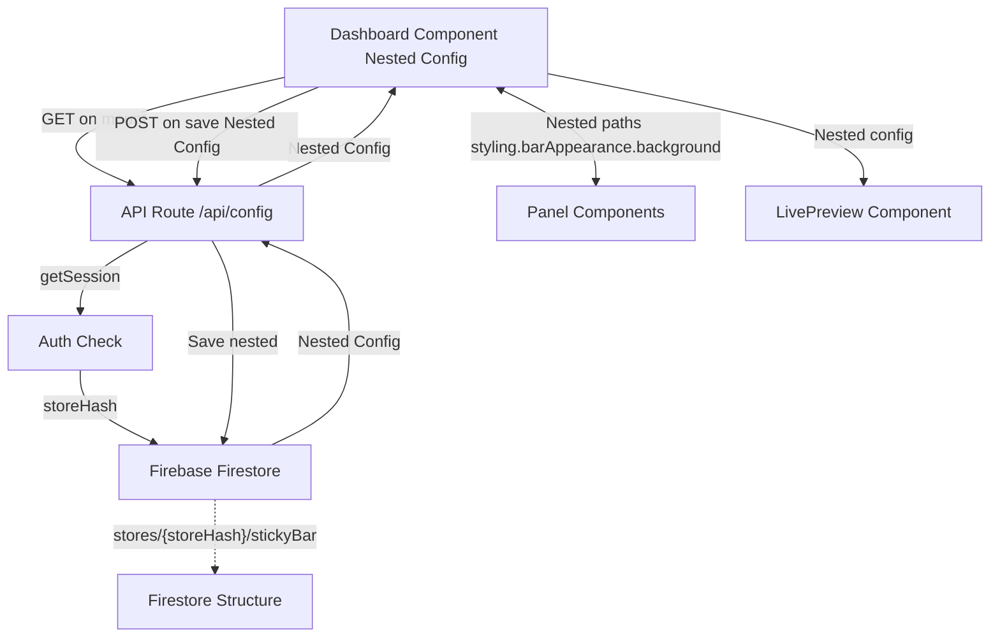

# Firebase Configuration Storage Implementation

## Overview

Convert the flat configuration object to a nested structure used throughout the entire application, and implement Firebase storage per store using the store hash as the document identifier. No flat-to-nested conversions - nested structure is used everywhere.

## Current State Analysis

**Existing Setup:**

- Firebase Admin SDK initialized in `[lib/dbs/firebase.ts](lib/dbs/firebase.ts)`
- Store authentication working with BigCommerce
- Collections: `users`, `stores` (containing accessToken, adminId, scope)
- Flat config structure in `[app/dashboard/page.tsx](app/dashboard/page.tsx)` with 20+ properties at root level

**Current Config Structure (Flat):**

```typescript
{
  enabled, position, triggerMode, triggerDelay, animation, animationDuration,
  barBgColor, barBorderRadius, barPadding, barShadow, barOffset,
  titleColor, priceColor, fontFamily, fontSize,
  buttonBgColor, buttonTextColor, buttonBorderRadius, buttonStyle,
  elementGap, showOnMobile, mobileCompact, elements: [...]
}
```

## New Nested Structure

```typescript
stickyBar: {
  styling: {
    barAppearance: {
      background: string
      borderRadius: number
      padding: number
      shadow: string
      offset: number
    }
    typography: {
      titleColor: string
      priceColor: string
      fontFamily: string
      fontSize: string
    }
    button: {
      bgColor: string
      textColor: string
      borderRadius: number
      style: string
    }
  }
  layout: {
    elements: Array<{id, label, visible}>
    position: string
    spacing: {
      elementGap: number
      barOffset: number
    }
  }
  behavior: {
    display: {
      enabled: boolean
      triggerMode: string
      triggerDelay: number
    }
    animation: {
      type: string
      duration: number
    }
    mobile: {
      showOnMobile: boolean
      mobileCompact: boolean
    }
  }
}
```

## Implementation Steps

### 1. Create TypeScript Types

**File:** `[types/config.ts](types/config.ts)` (new)

Define interfaces for the nested configuration structure:

- `StickyBarConfig` - Root interface
- `StylingConfig`, `LayoutConfig`, `BehaviorConfig` - Section interfaces
- `BarAppearanceConfig`, `TypographyConfig`, `ButtonConfig` - Subsection interfaces
- Helper type for backward compatibility with flat structure

### 2. Update Firebase Database Functions

**File:** `[lib/dbs/firebase.ts](lib/dbs/firebase.ts)`

Add new functions:

```typescript
// Save sticky bar config for a store
export async function setStickyBarConfig(storeHash: string, config: StickyBarConfig)

// Load sticky bar config for a store
export async function getStickyBarConfig(storeHash: string): Promise<StickyBarConfig | null>

// Delete sticky bar config (for cleanup)
export async function deleteStickyBarConfig(storeHash: string)
```

**Firestore Structure:**

```
stores/{storeHash}/
  - accessToken
  - adminId
  - scope
  - stickyBar: {
      styling: {...}
      layout: {...}
      behavior: {...}
    }
```

### 3. Create API Route for Config Management

**File:** `[app/api/config/route.ts](app/api/config/route.ts)` (new)

Endpoints:

- `GET` - Fetch nested config for authenticated store
- `POST` - Save nested config for authenticated store
- Handle authentication using `getSession()` from `[lib/auth.ts](lib/auth.ts)`
- Use the new Firebase functions
- Return nested structure directly

### 4. Default Configuration

**File:** `[lib/defaultConfig.ts](lib/defaultConfig.ts)` (new)

Move default config from dashboard component to shared file with nested structure:

```typescript
export const defaultStickyBarConfig: StickyBarConfig = {
  styling: {
    barAppearance: {
      background: "#FFFFFF",
      borderRadius: 0,
      padding: 12,
      shadow: "lg",
      offset: 0
    },
    typography: {
      titleColor: "#1F2937",
      priceColor: "#1F2937",
      fontFamily: "inherit",
      fontSize: "md"
    },
    button: {
      bgColor: "#2563EB",
      textColor: "#FFFFFF",
      borderRadius: 8,
      style: "filled"
    }
  },
  layout: {
    elements: [...],
    position: "bottom",
    spacing: {
      elementGap: 12,
      barOffset: 0
    }
  },
  behavior: {
    display: {
      enabled: true,
      triggerMode: "scroll",
      triggerDelay: 3
    },
    animation: {
      type: "slide",
      duration: 300
    },
    mobile: {
      showOnMobile: true,
      mobileCompact: true
    }
  }
}
```

### 5. Update Dashboard Component

**File:** `[app/dashboard/page.tsx](app/dashboard/page.tsx)`

Changes needed:

1. Change state from flat to nested: `useState<StickyBarConfig>(defaultStickyBarConfig)`
2. Add `useEffect` to load config from API on mount
3. Add loading state while fetching
4. Update `handleSave` to POST nested config to API endpoint
5. Update `updateConfig` to work with nested paths

Example flow:

```typescript
// State uses nested structure
const [config, setConfig] = useState<StickyBarConfig>(defaultStickyBarConfig)
const [savedConfig, setSavedConfig] = useState<StickyBarConfig>(defaultStickyBarConfig)

// On mount
useEffect(() => {
  async function loadConfig() {
    const response = await fetch('/api/config?context=...')
    const nestedConfig = await response.json()
    setConfig(nestedConfig)
    setSavedConfig(nestedConfig)
  }
  loadConfig()
}, [])

// On save - direct nested structure
async function handleSave() {
  await fetch('/api/config', {
    method: 'POST',
    body: JSON.stringify(config)
  })
}

// Update function now uses nested paths
const updateConfig = useCallback((path: string, value: any) => {
  setConfig(prev => {
    const keys = path.split('.')
    const updated = {...prev}
    let current: any = updated
    for (let i = 0; i < keys.length - 1; i++) {
      current[keys[i]] = {...current[keys[i]]}
      current = current[keys[i]]
    }
    current[keys[keys.length - 1]] = value
    return updated as StickyBarConfig
  })
}, [])
```

### 6. Update Panel Components

**Files:** 

- `[components/dashboard/stylePanel.tsx](components/dashboard/stylePanel.tsx)`
- `[components/dashboard/layoutPanel.tsx](components/dashboard/layoutPanel.tsx)`
- `[components/dashboard/behaviorPanel.tsx](components/dashboard/behaviorPanel.tsx)`

Update each panel to work with nested config structure:

**StylePanel changes:**

```typescript
// Old: updateConfig("barBgColor", v)
// New: updateConfig("styling.barAppearance.background", v)

// Old: config.barBgColor
// New: config.styling.barAppearance.background
```

**LayoutPanel changes:**

```typescript
// Old: config.elements
// New: config.layout.elements

// Old: config.position
// New: config.layout.position
```

**BehaviorPanel changes:**

```typescript
// Old: config.enabled
// New: config.behavior.display.enabled

// Old: config.animation
// New: config.behavior.animation.type
```

### 7. Update LivePreview Component

**File:** `[components/dashboard/livePreview.tsx](components/dashboard/livePreview.tsx)`

Update all references to use nested config paths:

```typescript
// Old: config.barBgColor
// New: config.styling.barAppearance.background

// Old: config.position
// New: config.layout.position

// Old: config.enabled
// New: config.behavior.display.enabled
```

### 8. Update Types Export

**File:** `[types/index.ts](types/index.ts)`

Add export for new config types:

```typescript
export * from './config';
```

### 9. Error Handling & Validation

Add validation:

- Validate config structure before saving
- Handle missing/corrupted data gracefully
- Fallback to defaults if load fails
- Toast notifications for success/error states

## Data Flow Diagram




## Migration Strategy

Since this is a new feature, no data migration needed. However:

1. Return defaults if no config exists in Firebase
2. Validate loaded config structure
3. Merge with defaults for any missing properties
4. Log any structure mismatches for debugging

## Testing Checklist

- Load config on dashboard mount
- Save config persists to Firebase
- Config loads correctly after page refresh
- Multiple stores have isolated configs
- Default config loads for new stores
- Error states handled gracefully
- Toast notifications work correctly

## Files to Create/Modify

**New Files:**

- `types/config.ts` - Nested config type definitions
- `lib/defaultConfig.ts` - Default nested configuration
- `app/api/config/route.ts` - API endpoints for config

**Modified Files:**

- `lib/dbs/firebase.ts` - Add config CRUD functions (getStickyBarConfig, setStickyBarConfig)
- `app/dashboard/page.tsx` - Use nested config structure, load/save via API
- `components/dashboard/stylePanel.tsx` - Update to nested config paths
- `components/dashboard/layoutPanel.tsx` - Update to nested config paths
- `components/dashboard/behaviorPanel.tsx` - Update to nested config paths
- `components/dashboard/livePreview.tsx` - Update to nested config paths
- `types/index.ts` - Export new config types

